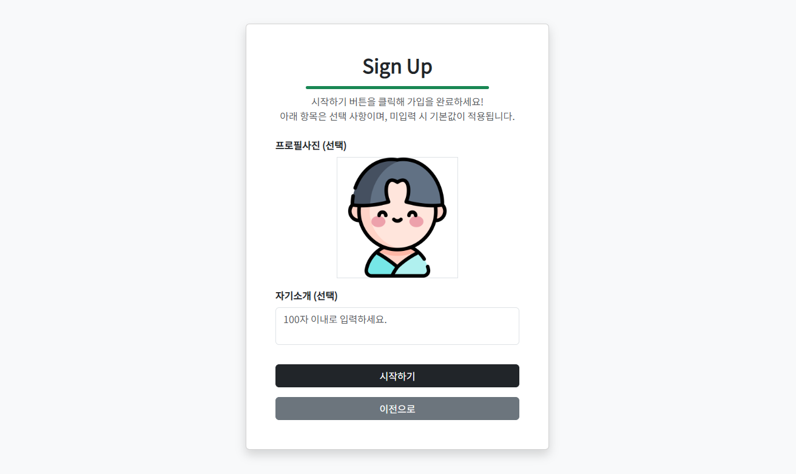

# 👨‍👩‍👧 스터디 매칭 플랫폼 :: Study With
***

* 배포 URL : [http://www.studywith.site](http://www.studywith.site)
* 프론트앤드 URL : [https://github.com/geongeongeon/StudyWith-frontend](https://github.com/geongeongeon/StudyWith-frontend)

 

### 📋 목차
***
* [소개 및 목적](#-소개-및-목적)
* [팀원](#-팀원)
* [개발 일정](#-개발-일정)
* [개발 환경](#%EF%B8%8F-개발-환경)
* [컨벤션](#-컨벤션)
* [프로젝트 구조](#%EF%B8%8F-프로젝트-구조)
* [데이터베이스 설계](#-데이터베이스-설계)
* [앤드포인트 및 라우터](#-앤드포인트-및-라우터)
* [기능 상세](#-기능-상세)
* [기술적 의사 결정](#-기술적-의사-결정)
* [트러블 슈팅](#-트러블-슈팅)
* [프로젝트 회고](#-프로젝트-회고)

 

### 📢 소개 및 목적
***
* **StudyWith**는 이름 그대로, 다른 사람들과 어떤 분야를 함께 공부할 수 있는 스터디 그룹을 구하는 플랫폼이다.

  * 검색을 통해 관심사와 지역을 기반으로 맞춤형 스터디 그룹을 검색할 수 있다.
  * 사용자가 원하는 스터디 그룹을 직접 개설하고 관리할 수 있다.
  * 같은 스터디 그룹 내 다른 사용자들과 소통할 수 있다.
  * 사용자 친화적인 UI/UX를 제공하고 화면 크기에 따라 최적화 설계가 되어 있다.

* 그동안 단순히 어떤 것에 대해 공부를 하고 완성된 프로젝트에 적용해본 경험이 부족하다고 느껴, 실제로 하나의 프로젝트에 적용해보고자 한다.

* 실무와 유사한 프로젝트 진행 경험을 쌓기 위해 설계부터 테스트 및 배포까지 전체 개발 과정을 직접 체험해보고자 본 프로젝트를 진행한다.

  

### 👨‍💻 팀원
***
* 총 1명

|  |
|:-----------------------------:|
| **이건희** |
| [@geongeongeon](https://github.com/geongeongeon) |

  

### 📅 개발 일정
***
* **백앤드** : 2025. 04. 11 ~ 2025. 08. 06
* **프론트앤드** : 2025. 04. 07 ~ 2025. 08. 06

  

### 🖥️ 개발 환경
***
- **Language**  
  ![JAVA](https://img.shields.io/badge/JAVA17-007396?style=flat&logo=data:image/svg%2bxml;base64,PCFET0NUWVBFIHN2ZyBQVUJMSUMgIi0vL1czQy8vRFREIFNWRyAxLjEvL0VOIiAiaHR0cDovL3d3dy53My5vcmcvR3JhcGhpY3MvU1ZHLzEuMS9EVEQvc3ZnMTEuZHRkIj4KDTwhLS0gVXBsb2FkZWQgdG86IFNWRyBSZXBvLCB3d3cuc3ZncmVwby5jb20sIFRyYW5zZm9ybWVkIGJ5OiBTVkcgUmVwbyBNaXhlciBUb29scyAtLT4KPHN2ZyB3aWR0aD0iMTUwcHgiIGhlaWdodD0iMTUwcHgiIHZpZXdCb3g9IjAgMCAzMi4wMCAzMi4wMCIgdmVyc2lvbj0iMS4xIiB4bWxucz0iaHR0cDovL3d3dy53My5vcmcvMjAwMC9zdmciIHhtbG5zOnhsaW5rPSJodHRwOi8vd3d3LnczLm9yZy8xOTk5L3hsaW5rIiBmaWxsPSIjZmZmZmZmIiBzdHJva2U9IiNmZmZmZmYiIHN0cm9rZS13aWR0aD0iMC4yNTYiPgoNPGcgaWQ9IlNWR1JlcG9fYmdDYXJyaWVyIiBzdHJva2Utd2lkdGg9IjAiLz4KDTxnIGlkPSJTVkdSZXBvX3RyYWNlckNhcnJpZXIiIHN0cm9rZS1saW5lY2FwPSJyb3VuZCIgc3Ryb2tlLWxpbmVqb2luPSJyb3VuZCIvPgoNPGcgaWQ9IlNWR1JlcG9faWNvbkNhcnJpZXIiPiA8cGF0aCBmaWxsPSIjZmZmZmZmIiBkPSJNMTIuNTU3IDIzLjIyYzAgMC0wLjk4MiAwLjU3MSAwLjY5OSAwLjc2NSAyLjAzNyAwLjIzMiAzLjA3OSAwLjE5OSA1LjMyNC0wLjIyNiAwIDAgMC41OSAwLjM3IDEuNDE1IDAuNjkxLTUuMDMzIDIuMTU3LTExLjM5LTAuMTI1LTcuNDM3LTEuMjN6TTExLjk0MiAyMC40MDVjMCAwLTEuMTAyIDAuODE2IDAuNTgxIDAuOTkgMi4xNzYgMC4yMjQgMy44OTUgMC4yNDMgNi44NjktMC4zMyAwIDAgMC40MTEgMC40MTcgMS4wNTggMC42NDUtNi4wODUgMS43NzktMTIuODYzIDAuMTQtOC41MDgtMS4zMDV6TTE3LjEyNyAxNS42M2MxLjI0IDEuNDI4LTAuMzI2IDIuNzEzLTAuMzI2IDIuNzEzczMuMTQ5LTEuNjI1IDEuNzAzLTMuNjYxYy0xLjM1MS0xLjg5OC0yLjM4Ni0yLjg0MSAzLjIyMS02LjA5MyAwIDAtOC44MDEgMi4xOTgtNC41OTggNy4wNDJ6TTIzLjc4MyAyNS4zMDJjMCAwIDAuNzI3IDAuNTk5LTAuODAxIDEuMDYyLTIuOTA1IDAuODgtMTIuMDkxIDEuMTQ2LTE0LjY0MyAwLjAzNS0wLjkxNy0wLjM5OSAwLjgwMy0wLjk1MyAxLjM0NC0xLjA2OSAwLjU2NC0wLjEyMiAwLjg4Ny0wLjEgMC44ODctMC4xLTEuMDIwLTAuNzE5LTYuNTk0IDEuNDExLTIuODMxIDIuMDIxIDEwLjI2MiAxLjY2NCAxOC43MDYtMC43NDkgMTYuMDQ0LTEuOTV6TTEzLjAyOSAxNy40ODljMCAwLTQuNjczIDEuMTEtMS42NTUgMS41MTMgMS4yNzQgMC4xNzEgMy44MTQgMC4xMzIgNi4xODEtMC4wNjYgMS45MzQtMC4xNjMgMy44NzYtMC41MSAzLjg3Ni0wLjUxcy0wLjY4MiAwLjI5Mi0xLjE3NSAwLjYyOWMtNC43NDUgMS4yNDgtMTMuOTExIDAuNjY3LTExLjI3Mi0wLjYwOSAyLjIzMi0xLjA3OSA0LjA0Ni0wLjk1NiA0LjA0Ni0wLjk1NnpNMjEuNDEyIDIyLjE3NGM0LjgyNC0yLjUwNiAyLjU5My00LjkxNSAxLjAzNy00LjU5MS0wLjM4MiAwLjA3OS0wLjU1MiAwLjE0OC0wLjU1MiAwLjE0OHMwLjE0Mi0wLjIyMiAwLjQxMi0wLjMxOGMzLjA3OS0xLjA4MyA1LjQ0OCAzLjE5My0wLjk5NCA0Ljg4Ny0wIDAgMC4wNzUtMC4wNjcgMC4wOTctMC4xMjZ6TTE4LjUwMyAzLjMzN2MwIDAgMi42NzEgMi42NzItMi41MzQgNi43ODEtNC4xNzQgMy4yOTYtMC45NTIgNS4xNzYtMC4wMDIgNy4zMjMtMi40MzYtMi4xOTgtNC4yMjQtNC4xMzMtMy4wMjUtNS45MzQgMS43NjEtMi42NDQgNi42MzgtMy45MjUgNS41Ni04LjE3ek0xMy41MDMgMjguOTY2YzQuNjMgMC4yOTYgMTEuNzQtMC4xNjQgMTEuOTA4LTIuMzU1IDAgMC0wLjMyNCAwLjgzMS0zLjgyNiAxLjQ5LTMuOTUyIDAuNzQ0LTguODI2IDAuNjU3LTExLjcxNiAwLjE4IDAgMCAwLjU5MiAwLjQ5IDMuNjM1IDAuNjg1eiIvPiA8L2c+Cg08L3N2Zz4=)
  
  
  

- **Database**  
  
  

- **Framework**  
  
  
  

- **Version Control & Deployment**  
  
  
  

  

### 📝 컨벤션
***
* **Backend Naming Convention**  
  * 모든 이름은 기능과 연관된 영어 단어를 사용하고, 축약 없이 작성한다.
  * 패키지명은 `lowercase`를 따르며, 각 단어는 점(.)으로 구분한다.
  * 클래스명과 인터페이스명은 `PascalCase`를 따른다.
  * 메서드명은 `camelCase`를 따른다.
  * 변수명은 `camelCase`를 따른다.
  * 상수명은 `SCREAMING_SNAKE_CASE`를 따른다.
  * 기타 리소스 파일명은 `kebab-case`를 따른다.

* **Frontend Naming Convention**  
  * 모든 이름은 기능과 연관된 영어 단어를 사용한다.
  * 디렉토리명은 `lowercase`를 따른다.
  * 컴포넌트 파일명은 `PascalCase`를 따른다.
  * CSS 파일명은 `kebab-case`를 따른다.
  * JS 파일명은 `kebab-case`를 따른다.
  * Pinia 관련 파일명은 `camelCase`를 따른다.
  * HTML 각 태그의 id명과 class명은 부트스트랩과 구분하기 위해 `snake_case`를 따른다.
  * 함수명은 `camelCase`를 따른다.
  * 변수명은 `camelCase`를 따른다.
  * 상수명은 `SCREAMING_SNAKE_CASE`를 따른다.

* **RESTful API Design Convention**  
  * URI는 동사 사용을 지양하고 `복수형 명사` 사용을 지향하며 소문자로 작성한다.
  * 동작은 HTTP 메서드인 `GET, POST, PUT, DELETE`를 통해 표현한다.
  * `슬래시(/)`를 통해 계층을 세분화하고, URI의 끝에는 사용하지 않는다.
  * 언더스코어(_)를 사용하지 않고 `하이픈(-)`을 사용한다.
  * 요청 시 보안이 필요한 데이터를 URI에 노출시키지 않는다.
  * 응답은 `HTTP 상태 코드, 본문, 메세지`를 포함한 JSON 형태로 한다. 

* **Commit Convention**  
  * 모든 커밋 메세지는 커밋 타입으로 시작하고, 내용은 영어로 작성한다.
  * `init:` 프로젝트 생성 및 기본 설정을 추가할 때 사용한다.
  * `feat:` 새로운 기능을 추가할 때 사용한다.
  * `fix:` 버그를 수정할 때 사용한다.
  * `refactor:` 코드를 리팩토링했을 때 사용한다.
  * `chore:` 빌드 및 설정 파일을 수정했을 때 사용한다.
  * `docs:` 문서 파일을 수정했을 때 사용한다.

 

### 🗂️ 프로젝트 구조
***
* **백앤드** 🔗[백앤드 프로젝트 구조 보기](https://github.com/geongeongeon/StudyWith-backend/wiki/프로젝트-구조-‐-백앤드)

  백앤드는 규모가 크고 복잡한 로직을 도메인별로 분리하여, 각 도메인 간 결합도를 낮추고 책임을 명확히 하여 유지보수성과 확장성을 높일 수 있도록 `도메인 중심 구조(Domain-Driven Design)`를 기반으로 설계했다.

* **프론트앤드** 🔗[프론트앤드 프로젝트 구조 보기](https://github.com/geongeongeon/StudyWith-backend/wiki/프로젝트-구조-‐-프론트앤드)

  프론트앤드는 상대적으로 규모가 작고 단순하기 때문에, 계층별로 분리하여 전체 구조를 직관적으로 파악할 수 있도록 전통적인 `계층형 구조(Layered Architecture)`를 기반으로 설계했다.

 

### 💾 데이터베이스 설계
***
* **관계형 데이터베이스** `MySQL` 🔗[SQL 보기](https://github.com/geongeongeon/StudyWith-backend/wiki/데이터베이스-‐-MySQL)
  * Entity-Relationship Diagram(`ERD`)
  

  * 서비스의 핵심 데이터인 회원, 스터디, 쪽지와 관련된 모든 데이터들을 저장한다.
  * 다대다 관계는 중간 테이블을 통해 다대일, 일대다 관계로 설계했다. 

* **비관계형 데이터베이스** `Redis`
  * 빠른 조회를 위한 캐시, 회원 가입 등에 필요한 임시 데이터, 사용자 인증 토큰과 관련된 데이터들을 저장한다.
  * key - value 형태로 데이터를 저장하고, 설정된 TTL이 만료되면 데이터가 자동으로 삭제된다.

 

### 🚩 앤드포인트 및 라우터
***
* **앤드포인트**  
  Base URL: `http://api.studywith.site:8080`

  |     | 메서드                                                                | 경로                                              | 설명                                   |
  |-----|----------------------------------------------------------------------|-------------------------------------------------|--------------------------------------|
  | 1   |       | /connection/test                                | 서버 연결 테스트                            |
  | 2   |       | /oauth2/authorization/{provider}                | OAuth2 로그인 요청                        |
  | 3   |      | /auth/token/refresh                             | 토큰 재발급 요청                            |
  | 4   |      | /auth/logout                                    | 로그아웃 요청                              |
  | 5   |       | /members                                        | 회원 목록 조회                             |
  | 6   |       | /members/{id}                                   | 특정 회원({id}) 조회                       |
  | 7   |       | /members/me                                     | 본인 정보 조회                             |
  | 8   |       | /members/exists?nickname={nickname}             | 닉네임 중복 여부 조회                         |
  | 9   |      | /members                                        | 회원 가입                                |
  | 10  |      | /members/{id}                                   | 특정 회원({id}) 정보 수정                    |
  | 11  |      | /members/me                                     | 본인 정보 수정                             |
  | 12  |   | /members/{id}                                   | 특정 회원({id}) 추방                       |
  | 13  |   | /members/me                                     | 본인 회원 탈퇴                             |
  | 14  |       | /studies                                        | 스터디 목록 조회                            |
  | 15  |       | /studies/{id}                                   | 특정 스터디({id}) 조회                      |
  | 16  |       | /studies/my                                     | 본인이 가입한 스터디 목록 조회                    |
  | 17  |       | /studies/{id}/members                           | 특정 스터디({id}) 회원 목록 조회                |
  | 18  |       | /studies/{id}/join-requests                     | 특정 스터디({id}) 가입 요청 목록 조회             |
  | 19  |      | /studies                                        | 스터디 생성                               |
  | 20  |      | /studies/{id}/join-requests                     | 특정 스터디({id}) 가입 요청 제출                |
  | 21  |      | /studies/{id}/join-requests/{memberId}/accept   | 특정 스터디({id}) 회원({memberId}) 가입 승인    |
  | 22  |      | /studies/{id}/manager                           | 스터디 부관리자에게 총관리자 권한을 위임               |
  | 23  |      | /studies/{id}/sub-manager/{memberId}            | 특정 스터디({id}) 회원({memberId})를 부관리자로 설정 |
  | 24  |      | /studies/{id}/recruitment                       | 스터디 모집 상태 변경                         |
  | 25  |   | /studies                                        | 스터디 삭제                               |
  | 26  |   | /studies/{id}/sub-manager                       | 스터디 부관리자 권한 해제                       |
  | 27  |   | /studies/{id}/join-requests/{memberId}          | 특정 가입 요청({memberId}) 거절              |
  | 28  |   | /studies/{id}/members                           | 특정 스터디({id}) 모든 회원 추방                |
  | 29  |   | /studies/{id}/members/{memberId}                | 특정 스터디({id}) 회원({memberId}) 추방       |
  | 30  |   | /studies/{id}/members/me                        | 본인 스터디 탈퇴                            |
  | 31  |       | /messages                                       | 쪽지 목록 조회                             |
  | 32  |       | /messages/{id}                                  | 특정 쪽지({id}) 조회                       |
  | 33  |      | /messages                                       | 쪽지 전송                                |
  | 34  |   | /messages                                       | 모든 쪽지 삭제                             |
  | 35  |   | /messages/{id}                                  | 특정 쪽지({id}) 삭제                       |

* **라우터**  
  Base URL: `http://www.studywith.site`

  |  | 경로                 | 설명                 |
  |----|---------------------|--------------------|
  | 1  | /                   | 홈 페이지              |
  | 2  | /auth/login         | 로그인 페이지            |
  | 3  | /auth/signup/step1  | 회원가입 1단계 페이지       |
  | 4  | /auth/signup/step2  | 회원가입 2단계 페이지       |
  | 5  | /members/me         | 본인 정보 페이지          |
  | 6  | /studies            | 스터디 목록 페이지         |
  | 7  | /studies/:id        | 특정 스터디(:id) 정보 페이지 |
  | 8  | /studies/create     | 스터디 생성 페이지         |

 

### ✨ 기능 상세
***
<table>
  <tr>
    <th width=12%>기능</th>
    <th>페이지</th>
    <th width=28%>설명</th>
  </tr>

  <tr>
    <td >홈</td>
    <td></td>
    <td>헤더에는 로그인 상태에 따라 로그인 / 프로필 사진, 별명, 쪽지함, 로그아웃이 표시된다.</td>
  </tr>

  <tr>
    <td>로그인</td>
    <td></td>
    <td>본인의 구글, 네이버, 카카오 계정을 통해 로그인을 할 수 있다.</td>
  </tr>

  <tr>
    <td>회원 가입-1</td>
    <td></td>
    <td>서비스 이용 시에 필요한 최소한의 정보들만 필수로 입력받는다.</td>
  </tr>

  <tr>
    <td>회원 가입-2</td>
    <td></td>
    <td>선택적으로 추가 정보를 입력 받으며, 입력하지 않을 경우 기본값으로 가입된다.</td>
  </tr>

  <tr>
    <td>스터디 목록</td>
    <td></td>
    <td>스터디명 · 내용 · 지역 · 태그로 스터디를 검색할 수 있으며, 모집 상태 필터와 인기순 / 최신순 정렬을 적용할 수 있다.</td>
  </tr>

  <tr>
    <td>스터디 정보</td>
    <td></td>
    <td>스터디의 상세 정보를 확인할 수 있고, 가입 상태에 따라 가입 요청 버튼이 표시된다.</td>
  </tr>

  <tr>
    <td>스터디 회원 목록</td>
    <td></td>
    <td>스터디의 회원 목록을 확인할 수 있고, 권한에 따라 다른 회원에게 권한 설정 · 쪽지 · 내보내기를 할 수 있다.</td>
  </tr>

  <tr>
    <td>스터디 가입 요청 목록</td>
    <td></td>
    <td>스터디에 가입을 요청한 회원 목록을 확인하고 승인 및 거절을 할 수 있다.</td>
  </tr>

  <tr>
    <td>스터디 탈퇴</td>
    <td></td>
    <td>체크 박스를 클릭하면 생기는 입력 창에 '탈퇴하겠습니다'를 입력하면 스터디에서 탈퇴된다.</td>
  </tr>

  <tr>
    <td>가입한 스터디</td>
    <td></td>
    <td>본인이 가입한 스터디를 확인할 수 있으며, 각 스터디 카드를 클릭하면 해당하는 스터디 페이지로 이동한다.</td>
  </tr>

  <tr>
    <td>회원 정보</td>
    <td></td>
    <td>본인의 회원 정보를 확인하고 일부 필드를 수정할 수 있다.</td>
  </tr>

  <tr>
    <td>회원 탈퇴</td>
    <td></td>
    <td>체크 박스를 클릭하면 생기는 입력 창에 '탈퇴하겠습니다'를 입력하면 사이트에서 탈퇴된다.</td>
  </tr>

  <tr>
    <td>쪽지 목록</td>
    <td></td>
    <td>다른 회원들로부터 받은 쪽지들을 확인할 수 있으며, 각 쪽지를 클릭하면 내용이 표시되며, 휴지통 버튼을 통해 삭제할 수 있다.</td>
  </tr>

  <tr>
    <td>쪽지 작성</td>
    <td></td>
    <td>쪽지는 같은 스터디에 있는 회원끼리만 주고 받을 수 있으며, 특정 회원에게 쪽지 보내기 버튼을 클릭하면 스터디와 받는 사람이 자동으로 설정된다.</td>
  </tr>
</table>

 

### 💡 기술적 의사 결정
***
* **토큰 기반 인증 방식**

  * Spring Security에서 세션을 `STATELESS`(무상태)로 설정하고 상대적으로 서버 부하가 적은 토큰 기반 인증을 적용했다.
  * OAuth2 로그인이 성공하면 각 소셜 사이트에서 발급받은 `액세스 토큰`을 `헤더`에 담고, `리프레시 토큰`을 `SET_COOKIE`에 담아 응답했다.
  * 실제 API 요청 시 `인증 수단`으로 액세스 토큰을 사용하고, 리프레시 토큰은 액세스 토큰 `재발급`에 사용했다.
  * 액세스 토큰의 유효 시간은 30분으로 짧게 설정하고, 리프레시 토큰의 유효 시간은 7일로 길게 설정했다.

* **JPA 기반 데이터 처리**

  * 개발 중에 직접 SQL을 작성하지 않고도 데이터베이스에 데이터를 저장 · 수정 · 삭제 및 조회 작업이 가능하고, 반복적인 SQL 작성에 사용되는 시간을 줄이고 `비즈니스 로직 개발`에 집중하기 위해 JPA를 사용했다.
  * 간단한 작업은 Repository에 `findBy~`처럼 규칙에 맞는 이름의 메서드를 선언하여 내부적으로 자동으로 생성되는 쿼리를 이용했다.
  * 그리고 검색처럼 복잡한 쿼리가 필요할 경우에는 `QueryDSL`을 사용해서 자바 코드를 실제 SQL 문법과 유사하게 작성했다.
  * 상대적으로 복잡도는 낮지만 특정 조건 등을 세밀하게 다뤄야 할 경우에는 `JPQL`을 이용했다.

* **응답 성능 최적화**

  * 자주 요청되는 데이터는 Redis에 `캐시`를 저장하여, 데이터베이스 조회 횟수를 최소화해 서버 부하를 줄이고 응답 속도를 개선했다.
  * TTL을 설정하고, 데이터 변경 시 캐시를 갱신하여 데이터의 최신 상태를 유지했다.

* **클라우드 객체 스토리지**

  * 파일은 AWS에서 제공하는 클라우드 객체 스토리지인 `S3`에 저장하여 서버 저장 공간과 부하를 줄이고, 확장성과 안정성이 뛰어난 파일 저장 환경을 구현했다.
  * API 요청 시 `MultipartFile` 형태로 받은 파일을 랜덤한 `UUID`를 key로 사용하여 저장하거나, 해당하는 key를 이용하여 파일을 삭제했다.
  * 서버의 데이터베이스에는 파일이 저장된 URL을 저장하여, 서버의 직접적인 파일 관리 부담을 줄였다.
  
* **일관된 응답 처리**
  * 모든 API 요청에 대한 응답은 `HTTP 상태 코드`, `메세지`, `데이터` 형태로 하여 일관성을 유지했다.
  * 성공에 대한 응답은 `SuccessResponseUtil`에서 처리하고, 실패에 대한 응답은 `FailureResponseUtil`에서 처리했다.

* **계층화된 예외 처리**
  
  * 서비스에서 실제로 발생할 수 있는 예외들을 각각 커스텀 예외 클래스로 정의하여, 명확하고 구체적인 예외 처리를 구현했다.
  * `도메인별 ControllerAdvice`를 정의하여 각 도메인마다 발생할 수 있는 예외들을 분리하여 처리했다.
  * `글로벌 ControllerAdvice`를 정의하여 예기치 못한 예외나 공통적으로 발생할 수 있는 예외를 처리하고 일관된 응답을 제공했다.

* **통합 테스트**
  
  * 스프링부트 테스트 환경에서 `JUnit`을 활용하여 통합 테스트를 진행했다.
  * `@BeforeEach`를 통해 각 테스트 전 초기 데이터를 생성하고, `@Transactional`을 통해 각 테스트마다 데이터베이스 상태를 초기화하여 독립적인 테스트 환경을 보장했다.
  * 예상되는 예외는 `assertThatThrownBy()`를 사용해 적절한 예외가 발생하는지 검증했다.

* **싱글 페이지 애플리케이션**
  
  * 더 빠른 화면 전환과 성능 향상을 통해 사용자에게 동적인 경험을 줄 수 있는 SPA 방식을 선택했다.
  * Vue 3과 `Composition API`를 활용하여 코드의 재사용성과 가독성을 높여, 복잡한 컴포넌트를 관리하기 쉽게 만들었다.
  * 새로고침 없이 하나의 페이지 내에서 `Axios`를 활용한 비동기적 통신으로 필요한 데이터만 갱신하여 서버 부하를 줄이고 응답 속도를 높였다.

 

### 🚀 트러블 슈팅
***

* **SPA 상태 관리 관련 이슈**
    
  * 싱글 페이지의 특성 상 화면에 데이터가 렌더링된 동안만 메모리에 유지되고, 새로고침을 한 후에는 메모리에 임시 저장된 데이터들이 모두 삭제된다.
  * 소셜 로그인을 후 설정된 리다이렉트 URL로 이동하는 과정에서, 새로고침이 발생해 로그인 상태가 사라지고 정상적인 로그인 처리가 되지 않는 문제가 발생했다.
  * 이를 해결하기 위해 `Pinia`라는 상태 관리 라이브러리를 도입하여 로그인 상태를 저장하기로 했다.
  * 그렇게 새로고침을 한 후 로그인 상태는 유지되었으나 토큰이 없어 다른 API 요청에 실패하는 상태에 빠지게 되었다.
  * 그래서 로그인 성공 시 서버에서 응답에 액세스 토큰은 `응답 헤더`에 담고, 리프레시 토큰은 `SET_COOKIE`에 담아서 전달하자는 전략을 세웠다.
  * 프론트앤드에서는 응답에서 두 토큰을 각각 추출하여 로그인 상태와 함께 Pinia에 저장함으로써 문제를 해결했다.

* **OAuth2 토큰 관련 요청 이슈** 

  * 모든 API 요청은 먼저 `AuthenticationFilter`를 거치는데, 액세스 토큰이 없을 경우 리프레시 토큰을 통해 자동으로 액세스 토큰 재발급 API를 호출한다.
  * 네이버 로그인의 경우 짧은 시간에 많은 요청을 보내면 일시적인 오류가 발생한다는 것을 확인했다.
  * 이를 해결하기 위해 로그인한 사람의 ID를 key로 하여 Redis에 액세스 토큰을 일정 시간동안 저장하고 액세스 토큰이 남아 있을 경우 `재사용`하자는 전략을 세웠다.
  * AuthenticationFilter에서 로그인한 사람의 ID를 알아야 했는데, 요청 시 ID를 함께 보내면 되겠다고 생각했다.
  * 하지만 Spring Security가 먼저 요청을 가로채 AuthenticationFilter로 보내기 때문에 토큰 검증 전에는 요청 내용을 확인할 수 없었다.
  * 그래서 리프레시 토큰을 key로 해서 Redis에 로그인한 사람의 ID를 저장하고, 리프레시 토큰만으로 ID를 확인한 후 액세스 토큰도 확인하는 방법을 통해 문제를 해결했다.

 

### 💬 프로젝트 회고
***

* **아쉬운 점 **·** 개선할 점**
  1. `반응형 레이아웃`
     * 부트스트랩을 사용하여 반응형 레이아웃 설계나 디자인 등 전체적인 부분에서 많은 도움을 받았지만, 일부 마음에 들지 않는 요소들이 있어 직접 디자인 했지만 일부 페이지에서 반응형이 깨진 부분이 가장 아쉬운 것 같다.
  2. `캐시 전략`
     * 일부 도메인에서 캐시를 통해 조회 성능을 향상시키긴 했지만 캐시 유지와 최신 데이터 동기화 사이에서 고민을 정말 많이 했는데, 최종적으로 최선의 전략을 세우지 못한 것이 아쉽다.
  3. `Git 관리`
     * 프로젝트 초반에는 세분화해서 Git 관리를 했지만, 개인 프로젝트라는 안일함 때문에 후반에는 한 번에 몰아서 커밋하는 등 Git 관리를 소홀히 한 점이 아쉽다.

* **추가 개발 계획**
  1. `스터디 기능 추가`
     * 스터디 매칭 플랫폼이라는 주제에 맞춰, 가장 먼저 추가 해야할 것은 바로 스터디의 기능을 추가하는 것이다.
     * 대표적인 예시로, 문제 풀이나 후기 작성을 위한 게시판을 만들어 여러 사람들과 공유할 수 있도록 할 것이다. 
  2. `스터디 검색 필터 조건 다양화`
     * 현재 구현된 스터디 검색 필터에는 모집 상태에 관련된 조건밖에 없는데, 연령, 성별 등과 관련된 조건을 추가하여 좀 더 세밀한 검색이 가능하도록 할 것이다.
  4. `지도 API 사용`
     * 가입할 때 활동 지역을 시 · 군 · 구 단위로 입력 받고 있는데, 지도 API를 사용하여 더 정확한 위치를 계산하고 주변 스터디들을 검색할 수 있도록 할 것이다.
  5. `사이트 관리자 기능 추가`
     * 사이트 관리자 기능을 도입하여 사이트의 관리자인 내가 SQL을 사용하지 않고도 사이트를 편리하게 관리할 수 있도록 할 것이다.
    
* **후기**  

  일단 그동안 어떤 것에 대해서 배우면 미니 프로젝트로 그것을 적용해보긴 했지만 하나의 완성된 프로젝트를 만들어 본 경험이 오랜만인 것 같아 만족스럽고 재미있었다.
  그리고 팀 프로젝트가 아니라 기획부터 개발 및 배포까지 모든 것을 혼자 하면서 막히는 부분이 생길 경우 실질적으로 도움을 요청할 사람이 없어서 해결하기 위해 정말 고생한 것 같다.
  내가 생각했던 것보다 프로젝트 기간이 굉장히 오래 걸렸지만, 구글링을 하고 인강을 보며 끝까지 포기하지 않았다는 것으로도 만족스럽게 생각한다.
  팀 프로젝트가 아니여서 실제로 다른 사람들과 협업할 수는 없었던 것이 아쉬웠지만 구글링과 현업자 친구에게 실무에서는 어떤 식으로 개발하는지 조언을 들으며 최대한 실무처럼 해보려고 노력했다.
  이 과정에서 정보처리기사를 공부하며 디자인 패턴을 열심히 암기할 때 '실제로 개발할 떄 이런 것들이 다 쓰이기는 하는 걸까?' 하는 생각을 하곤 했었는데 실제로 여러가지 디자인 패턴이 사용된다는 것을 알게 되었다.
  실무 흉내를 내기 위해 배운 것들을 한번에 최대한 적용해보다 보니 분명히 미숙한 점이 많지만 그 과정에서의 성장을 의미있게 생각한다.
  그리고 API를 개발하고 Postman을 사용해 테스트를 진행했는데, 내가 생각하지 못했던 예외들이 끝도 없이 발생해서 놀랐다.
  끝도 없는 예외들을 하나하나 처리하기 위해 테스트가 굉장히 중요하다는 것을 깨닫게 되었다.
  실제로 실무에서는 개발 시간보다 테스트 케이스 작성하는 데에 시간을 더 쓴다는 말을 들은 적이 있는데 그 이유를 이번 프로젝트를 기회로 알게된 것 같다.
  이번 프로젝트를 통해 느낀 아쉬움을 발판 삼아, 다음에는 테스트 케이스를 꼼꼼히 작성하며 완성도를 높이고 아쉬웠던 점들을 개선해갈 것을 다짐으로 이번 프로젝트를 마무리한다.
