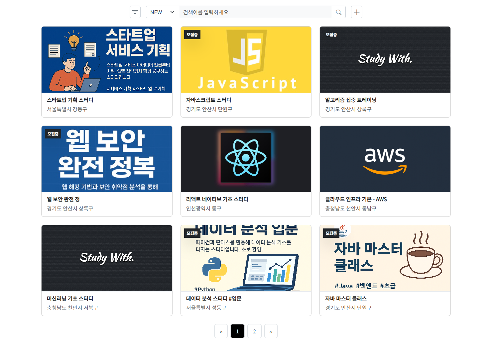

# 👨‍👩‍👧 스터디 매칭 플랫폼 :: Study With
***

* 배포 URL : [http://www.studywith.site](http://www.studywith.site)
* 프론트앤드 URL : [https://github.com/geongeongeon/StudyWith-frontend](https://github.com/geongeongeon/StudyWith-frontend)

 

### 📋 목차
***
* [프로젝트 소개](#프로젝트-소개)
* [팀원](#팀원)
* [개발 일정](#개발-일정)
* [컨벤션](#컨벤션)
* [프로젝트 구조](#프로젝트-구조)
* [데이터베이스 설계](#데이터베이스-설계)
* [앤드포인트 및 라우터](#앤드포인트-및-라우터)
* [기능 상세](#기능-상세)

 

### 📢 프로젝트 소개
***
* **StudyWith**는 이름 그대로, 다른 사람들과 어떤 분야를 함께 공부할 수 있는 스터디 그룹을 구하는 플랫폼이다.

  * 검색을 통해 관심사와 지역을 기반으로 맞춤형 스터디 그룹을 검색할 수 있다.
  * 사용자가 원하는 스터디 그룹을 직접 개설하고 관리할 수 있다.
  * 같은 스터디 그룹 내 다른 사용자들과 소통할 수 있다.
  * 사용자 친화적인 UI/UX를 제공하고 화면 크기에 따라 최적화 설계가 되어 있다.

  

### 👨‍💻 팀원
***
* 총 1명

|  |
|:-----------------------------:|
| **이건희** |
| [@geongeongeon](https://github.com/geongeongeon) |

  

### 📅 개발 일정
***
* **백앤드** : 2025. 04. 11 ~ 2025. 08. 06
* **프론트앤드** : 2025. 04. 07 ~ 2025. 08. 06

  

### 🖥️ 개발 환경
***
- **Language**  
  ![JAVA](https://img.shields.io/badge/JAVA17-007396?style=flat&logo=data:image/svg%2bxml;base64,PCFET0NUWVBFIHN2ZyBQVUJMSUMgIi0vL1czQy8vRFREIFNWRyAxLjEvL0VOIiAiaHR0cDovL3d3dy53My5vcmcvR3JhcGhpY3MvU1ZHLzEuMS9EVEQvc3ZnMTEuZHRkIj4KDTwhLS0gVXBsb2FkZWQgdG86IFNWRyBSZXBvLCB3d3cuc3ZncmVwby5jb20sIFRyYW5zZm9ybWVkIGJ5OiBTVkcgUmVwbyBNaXhlciBUb29scyAtLT4KPHN2ZyB3aWR0aD0iMTUwcHgiIGhlaWdodD0iMTUwcHgiIHZpZXdCb3g9IjAgMCAzMi4wMCAzMi4wMCIgdmVyc2lvbj0iMS4xIiB4bWxucz0iaHR0cDovL3d3dy53My5vcmcvMjAwMC9zdmciIHhtbG5zOnhsaW5rPSJodHRwOi8vd3d3LnczLm9yZy8xOTk5L3hsaW5rIiBmaWxsPSIjZmZmZmZmIiBzdHJva2U9IiNmZmZmZmYiIHN0cm9rZS13aWR0aD0iMC4yNTYiPgoNPGcgaWQ9IlNWR1JlcG9fYmdDYXJyaWVyIiBzdHJva2Utd2lkdGg9IjAiLz4KDTxnIGlkPSJTVkdSZXBvX3RyYWNlckNhcnJpZXIiIHN0cm9rZS1saW5lY2FwPSJyb3VuZCIgc3Ryb2tlLWxpbmVqb2luPSJyb3VuZCIvPgoNPGcgaWQ9IlNWR1JlcG9faWNvbkNhcnJpZXIiPiA8cGF0aCBmaWxsPSIjZmZmZmZmIiBkPSJNMTIuNTU3IDIzLjIyYzAgMC0wLjk4MiAwLjU3MSAwLjY5OSAwLjc2NSAyLjAzNyAwLjIzMiAzLjA3OSAwLjE5OSA1LjMyNC0wLjIyNiAwIDAgMC41OSAwLjM3IDEuNDE1IDAuNjkxLTUuMDMzIDIuMTU3LTExLjM5LTAuMTI1LTcuNDM3LTEuMjN6TTExLjk0MiAyMC40MDVjMCAwLTEuMTAyIDAuODE2IDAuNTgxIDAuOTkgMi4xNzYgMC4yMjQgMy44OTUgMC4yNDMgNi44NjktMC4zMyAwIDAgMC40MTEgMC40MTcgMS4wNTggMC42NDUtNi4wODUgMS43NzktMTIuODYzIDAuMTQtOC41MDgtMS4zMDV6TTE3LjEyNyAxNS42M2MxLjI0IDEuNDI4LTAuMzI2IDIuNzEzLTAuMzI2IDIuNzEzczMuMTQ5LTEuNjI1IDEuNzAzLTMuNjYxYy0xLjM1MS0xLjg5OC0yLjM4Ni0yLjg0MSAzLjIyMS02LjA5MyAwIDAtOC44MDEgMi4xOTgtNC41OTggNy4wNDJ6TTIzLjc4MyAyNS4zMDJjMCAwIDAuNzI3IDAuNTk5LTAuODAxIDEuMDYyLTIuOTA1IDAuODgtMTIuMDkxIDEuMTQ2LTE0LjY0MyAwLjAzNS0wLjkxNy0wLjM5OSAwLjgwMy0wLjk1MyAxLjM0NC0xLjA2OSAwLjU2NC0wLjEyMiAwLjg4Ny0wLjEgMC44ODctMC4xLTEuMDIwLTAuNzE5LTYuNTk0IDEuNDExLTIuODMxIDIuMDIxIDEwLjI2MiAxLjY2NCAxOC43MDYtMC43NDkgMTYuMDQ0LTEuOTV6TTEzLjAyOSAxNy40ODljMCAwLTQuNjczIDEuMTEtMS42NTUgMS41MTMgMS4yNzQgMC4xNzEgMy44MTQgMC4xMzIgNi4xODEtMC4wNjYgMS45MzQtMC4xNjMgMy44NzYtMC41MSAzLjg3Ni0wLjUxcy0wLjY4MiAwLjI5Mi0xLjE3NSAwLjYyOWMtNC43NDUgMS4yNDgtMTMuOTExIDAuNjY3LTExLjI3Mi0wLjYwOSAyLjIzMi0xLjA3OSA0LjA0Ni0wLjk1NiA0LjA0Ni0wLjk1NnpNMjEuNDEyIDIyLjE3NGM0LjgyNC0yLjUwNiAyLjU5My00LjkxNSAxLjAzNy00LjU5MS0wLjM4MiAwLjA3OS0wLjU1MiAwLjE0OC0wLjU1MiAwLjE0OHMwLjE0Mi0wLjIyMiAwLjQxMi0wLjMxOGMzLjA3OS0xLjA4MyA1LjQ0OCAzLjE5My0wLjk5NCA0Ljg4Ny0wIDAgMC4wNzUtMC4wNjcgMC4wOTctMC4xMjZ6TTE4LjUwMyAzLjMzN2MwIDAgMi42NzEgMi42NzItMi41MzQgNi43ODEtNC4xNzQgMy4yOTYtMC45NTIgNS4xNzYtMC4wMDIgNy4zMjMtMi40MzYtMi4xOTgtNC4yMjQtNC4xMzMtMy4wMjUtNS45MzQgMS43NjEtMi42NDQgNi42MzgtMy45MjUgNS41Ni04LjE3ek0xMy41MDMgMjguOTY2YzQuNjMgMC4yOTYgMTEuNzQtMC4xNjQgMTEuOTA4LTIuMzU1IDAgMC0wLjMyNCAwLjgzMS0zLjgyNiAxLjQ5LTMuOTUyIDAuNzQ0LTguODI2IDAuNjU3LTExLjcxNiAwLjE4IDAgMCAwLjU5MiAwLjQ5IDMuNjM1IDAuNjg1eiIvPiA8L2c+Cg08L3N2Zz4=)
  
  
  

- **Database**  
  
  

- **Framework**  
  
  
  

- **Version Control & Deployment**  
  
  
  

  

### 📝 컨벤션
***
* **Backend Naming Convention**  
  * 모든 이름은 기능과 연관된 영어 단어를 사용하고, 축약 없이 작성한다.
  * 패키지명은 `lowercase`를 따르며, 각 단어는 점(.)으로 구분한다.
  * 클래스명과 인터페이스명은 `PascalCase`를 따른다.
  * 메서드명은 `camelCase`를 따른다.
  * 변수명은 `camelCase`를 따른다.
  * 상수명은 `SCREAMING_SNAKE_CASE`를 따른다.
  * 기타 리소스 파일명은 `kebab-case`를 따른다.

* **Frontend Naming Convention**  
  * 모든 이름은 기능과 연관된 영어 단어를 사용한다.
  * 디렉토리명은 `lowercase`를 따른다.
  * 컴포넌트 파일명은 `PascalCase`를 따른다.
  * CSS 파일명은 `kebab-case`를 따른다.
  * JS 파일명은 `kebab-case`를 따른다.
  * Pinia 관련 파일명은 `camelCase`를 따른다.
  * HTML 각 태그의 id명과 class명은 부트스트랩과 구분하기 위해 `snake_case`를 따른다.
  * 함수명은 `camelCase`를 따른다.
  * 변수명은 `camelCase`를 따른다.
  * 상수명은 `SCREAMING_SNAKE_CASE`를 따른다.

* **RESTful API Design Convention**  
  * URI는 동사 사용을 지양하고 `복수형 명사` 사용을 지향하며 소문자로 작성한다.
  * 동작은 HTTP 메서드인 `GET, POST, PUT, DELETE`를 통해 표현한다.
  * `슬래시(/)`를 통해 계층을 세분화하고, URI의 끝에는 사용하지 않는다.
  * 언더스코어(_)를 사용하지 않고 `하이픈(-)`을 사용한다.
  * 요청 시 보안이 필요한 데이터를 URI에 노출시키지 않는다.
  * 응답은 `HTTP 상태 코드, 본문, 메세지`를 포함한 JSON 형태로 한다. 

* **Commit Convention**  
  * 모든 커밋 메세지는 커밋 타입으로 시작하고, 내용은 영어로 작성한다.
  * `init:` 프로젝트 생성 및 기본 설정을 추가할 때 사용한다.
  * `feat:` 새로운 기능을 추가할 때 사용한다.
  * `fix:` 버그를 수정할 때 사용한다.
  * `refactor:` 코드를 리팩토링했을 때 사용한다.
  * `chore:` 빌드 및 설정 파일을 수정했을 때 사용한다.
  * `docs:` 문서 파일을 수정했을 때 사용한다.

 

### 🗂️ 프로젝트 구조
***
* **백앤드** 🔗[백앤드 프로젝트 구조 보기](https://github.com/geongeongeon/StudyWith-backend/wiki/프로젝트-구조-‐-백앤드)

  백앤드는 규모가 크고 복잡한 로직을 도메인별로 분리하여, 각 도메인 간 결합도를 낮추고 책임을 명확히 하여 유지보수성과 확장성을 높일 수 있도록 `도메인 중심 구조(Domain-Driven Design)`를 기반으로 설계했다.

* **프론트앤드** 🔗[프론트앤드 프로젝트 구조 보기](https://github.com/geongeongeon/StudyWith-backend/wiki/프로젝트-구조-‐-프론트앤드)

  프론트앤드는 상대적으로 규모가 작고 단순하기 때문에, 계층별로 분리하여 전체 구조를 직관적으로 파악할 수 있도록 전통적인 `계층형 구조(Layered Architecture)`를 기반으로 설계했다.

 

### 💾 데이터베이스 설계
***
* **관계형 데이터베이스** `MySQL` 
  * 🔗[ERD 보기](https://dbdiagram.io/d/StudyWith-6895a011dd90d178650a7944) 
  * 🔗[SQL 보기](https://github.com/geongeongeon/StudyWith-backend/wiki/데이터베이스-‐-MySQL)
  * 서비스의 핵심 데이터인 회원, 스터디, 쪽지와 관련된 모든 데이터들을 저장한다.
  * 다대다 관계는 중간 테이블을 통해 다대일, 일대다 관계로 설계했다. 

* **비관계형 데이터베이스** `Redis`
  * 빠른 조회를 위한 캐시, 회원 가입 등에 필요한 임시 데이터, 사용자 인증 토큰과 관련된 데이터들을 저장한다.
  * 키-값 형태로 데이터를 저장하고, 설정된 TTL이 만료되면 데이터가 자동으로 삭제된다.

 

### 🚩 앤드포인트 및 라우터
***
* **앤드포인트**  
  Base URL: `http://api.studywith.site:8080`

  |     | 메서드                                                                | 경로                                              | 설명                                   |
  |-----|----------------------------------------------------------------------|-------------------------------------------------|--------------------------------------|
  | 1   |       | /connection/test                                | 서버 연결 테스트                            |
  | 2   |       | /oauth2/authorization/{provider}                | OAuth2 로그인 요청                        |
  | 3   |      | /auth/token/refresh                             | 토큰 재발급 요청                            |
  | 4   |      | /auth/logout                                    | 로그아웃 요청                              |
  | 5   |       | /members                                        | 회원 목록 조회                             |
  | 6   |       | /members/{id}                                   | 특정 회원({id}) 조회                       |
  | 7   |       | /members/me                                     | 본인 정보 조회                             |
  | 8   |       | /members/exists?nickname={nickname}             | 닉네임 중복 여부 조회                         |
  | 9   |      | /members                                        | 회원 가입                                |
  | 10  |      | /members/{id}                                   | 특정 회원({id}) 정보 수정                    |
  | 11  |      | /members/me                                     | 본인 정보 수정                             |
  | 12  |   | /members/{id}                                   | 특정 회원({id}) 추방                       |
  | 13  |   | /members/me                                     | 본인 회원 탈퇴                             |
  | 14  |       | /studies                                        | 스터디 목록 조회                            |
  | 15  |       | /studies/{id}                                   | 특정 스터디({id}) 조회                      |
  | 16  |       | /studies/my                                     | 본인이 가입한 스터디 목록 조회                    |
  | 17  |       | /studies/{id}/members                           | 특정 스터디({id}) 회원 목록 조회                |
  | 18  |       | /studies/{id}/join-requests                     | 특정 스터디({id}) 가입 요청 목록 조회             |
  | 19  |      | /studies                                        | 스터디 생성                               |
  | 20  |      | /studies/{id}/join-requests                     | 특정 스터디({id}) 가입 요청 제출                |
  | 21  |      | /studies/{id}/join-requests/{memberId}/accept   | 특정 스터디({id}) 회원({memberId}) 가입 승인    |
  | 22  |      | /studies/{id}/manager                           | 스터디 부관리자에게 총관리자 권한을 위임               |
  | 23  |      | /studies/{id}/sub-manager/{memberId}            | 특정 스터디({id}) 회원({memberId})를 부관리자로 설정 |
  | 24  |      | /studies/{id}/recruitment                       | 스터디 모집 상태 변경                         |
  | 25  |   | /studies                                        | 스터디 삭제                               |
  | 26  |   | /studies/{id}/sub-manager                       | 스터디 부관리자 권한 해제                       |
  | 27  |   | /studies/{id}/join-requests/{memberId}          | 특정 가입 요청({memberId}) 거절              |
  | 28  |   | /studies/{id}/members                           | 특정 스터디({id}) 모든 회원 추방                |
  | 29  |   | /studies/{id}/members/{memberId}                | 특정 스터디({id}) 회원({memberId}) 추방       |
  | 30  |   | /studies/{id}/members/me                        | 본인 스터디 탈퇴                            |
  | 31  |       | /messages                                       | 쪽지 목록 조회                             |
  | 32  |       | /messages/{id}                                  | 특정 쪽지({id}) 조회                       |
  | 33  |      | /messages                                       | 쪽지 전송                                |
  | 34  |   | /messages                                       | 모든 쪽지 삭제                             |
  | 35  |   | /messages/{id}                                  | 특정 쪽지({id}) 삭제                       |

* **라우터**  
  Base URL: `http://www.studywith.site`

  |  | 경로                 | 설명                 |
  |----|---------------------|--------------------|
  | 1  | /                   | 홈 페이지              |
  | 2  | /auth/login         | 로그인 페이지            |
  | 3  | /auth/signup/step1  | 회원가입 1단계 페이지       |
  | 4  | /auth/signup/step2  | 회원가입 2단계 페이지       |
  | 5  | /members/me         | 본인 정보 페이지          |
  | 6  | /studies            | 스터디 목록 페이지         |
  | 7  | /studies/:id        | 특정 스터디(:id) 정보 페이지 |
  | 8  | /studies/create     | 스터디 생성 페이지         |

 

### ✨ 기능 상세
***
<table>
  <tr>
    <th width=13%>기능</th>
    <th>페이지</th>
    <th width=27%>설명</th>
  </tr>

  <tr>
    <td >홈</td>
    <td></td>
    <td>헤더에는 로그인 상태에 따라 로그인 / 프로필 사진, 별명, 쪽지함, 로그아웃이 표시된다.</td>
  </tr>

  <tr>
    <td>로그인</td>
    <td></td>
    <td>본인의 구글, 네이버, 카카오 계정을 통해 로그인을 할 수 있다.</td>
  </tr>

  <tr>
    <td>회원 가입-1</td>
    <td></td>
    <td>서비스 이용 시에 필요한 최소한의 정보들만 필수로 입력받는다.</td>
  </tr>

  <tr>
    <td>회원 가입-2</td>
    <td></td>
    <td>선택적으로 추가 정보를 입력 받으며, 입력하지 않을 경우 기본값으로 가입된다.</td>
  </tr>

  <tr>
    <td>스터디 목록</td>
    <td></td>
    <td>스터디명 · 내용 · 지역 · 태그로 스터디를 검색할 수 있으며, 모집 상태 필터와 인기순 / 최신순 정렬을 적용할 수 있다.</td>
  </tr>

  <tr>
    <td>스터디 정보</td>
    <td></td>
    <td>스터디의 상세 정보를 확인할 수 있고, 가입 상태에 따라 가입 요청 버튼이 표시된다.</td>
  </tr>

  <tr>
    <td>스터디 회원 목록</td>
    <td></td>
    <td>스터디의 회원 목록을 확인할 수 있고, 권한에 따라 다른 회원에게 권한 설정 · 쪽지 · 내보내기를 할 수 있다.</td>
  </tr>

  <tr>
    <td>스터디 가입 요청 목록</td>
    <td></td>
    <td>스터디에 가입을 요청한 회원 목록을 확인하고 승인 및 거절을 할 수 있다.</td>
  </tr>

  <tr>
    <td>스터디 탈퇴</td>
    <td></td>
    <td>체크 박스를 클릭하면 생기는 입력 창에 '탈퇴하겠습니다'를 입력하면 스터디에서 탈퇴된다.</td>
  </tr>

  <tr>
    <td>가입한 스터디</td>
    <td></td>
    <td>본인이 가입한 스터디를 확인할 수 있으며, 각 스터디 카드를 클릭하면 해당하는 스터디 페이지로 이동한다.</td>
  </tr>

<tr>
    <td>회원 정보</td>
    <td></td>
    <td>본인의 회원 정보를 확인하고 수정할 수 있다.</td>
  </tr>

<tr>
    <td>회원 탈퇴</td>
    <td></td>
    <td>체크 박스를 클릭하면 생기는 입력 창에 '탈퇴하겠습니다'를 입력하면 사이트에서 탈퇴된다.</td>
  </tr>

<tr>
    <td>쪽지 목록</td>
    <td></td>
    <td>다른 회원들로부터 받은 쪽지들을 확인할 수 있으며, 각 쪽지를 클릭하면 내용이 표시되며, 휴지통 버튼을 통해 삭제할 수 있다.</td>
  </tr>

<tr>
    <td>쪽지 작성</td>
    <td></td>
    <td>쪽지는 같은 스터디에 있는 회원끼리만 주고 받을 수 있으며, 특정 회원에게 쪽지 보내기 버튼을 클릭하면 스터디와 받는 사람이 자동으로 설정된다.</td>
  </tr>
</table>

 